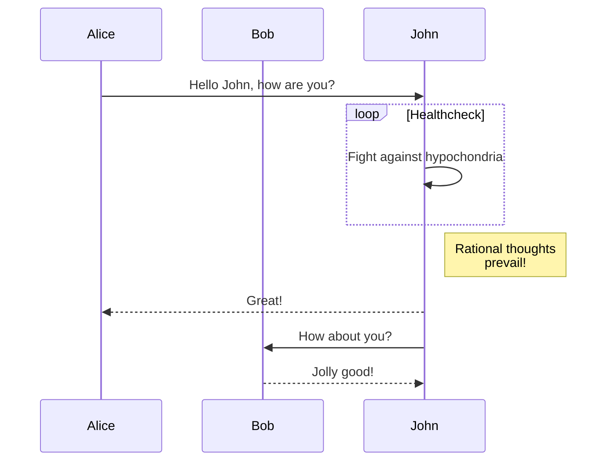

# OMB-01 - Prise en main de GitHub et Markdown

## Introduction

Ce premier cours est une introduction à GitHub et au language Markdown.

## Objectifs

L'objectif de ce cours est de vous familiariser avec GitHub et Markdown.

En fin de cours, vous devriez être capable de:
- Comprendre le fonctionnement de GitHub et de Markdown
- Savoir créer un dépôt public sur GitHub
- Savoir créer un fichier Markdown
- Savoir formater un fichier Markdown

## Liens vers les ressources

* [GitHub](https://github.com)
* [Markdown](https://guides.github.com/features/mastering-markdown/)
* [Markdown Cheatsheet](../resources/rmarkdown-cheatsheet.pdf)

## GitHub c'est quoi?

**GitHub** est un service web qui permet de stocker des fichiers et des dossiers dans un **dépôt**. Un dépôt est un ensemble de fichiers et de dossiers qui sont liés entre eux. Un dépôt peut être **privé ou public**. Un dépôt peut être créé par une personne ou une organisation. Un dépôt peut être créé pour un projet ou pour une entreprise.

Des alternatives à GitHub existent, par exemple:
- [GitLab](https://gitlab.com)
- [Bitbucket](https://bitbucket.org)
- [SourceForge](https://sourceforge.net)

### Quel problème GitHub résout-il?

GitHub permet de partager des fichiers et des dossiers avec d'autres personnes. Par exemple, vous pouvez partager des fichiers de code avec des collègues de travail ou des fichiers de documentation avec des clients.

### Qu'est-ce qu'un dépôt?

Tous les fichiers et dossiers d'un dépôt sont stockés dans un répertoire appelé le dépôt. Un dépôt peut contenir plusieurs répertoires. Un répertoire peut contenir des fichiers et d'autres répertoires.

Le dépôt peut être cloné sur votre ordinateur. Vous pouvez ensuite travailler sur les fichiers et dossiers du dépôt sur votre ordinateur.

Une fois que vous avez terminé de travailler sur les fichiers et dossiers du dépôt, 2 choses doivent être faites:
- Les fichiers et dossiers modifiés doivent être **commités**. Un commit est une sauvegarde des fichiers et dossiers modifiés et est lié à un message qui décrit les changements que vous avez apportés au dépôt. Il s'effectue soit via une commande Git dans le terminal, soit via l'interface web de GitHub, soit via l'interface graphique d'un logiciel comme [GitHub Desktop](https://desktop.github.com).
- Vous pouvez **commiter** les changements que vous avez apportés au dépôt. Un commit est une sorte de sauvegarde des changements que vous avez apportés au dépôt.  Ce commit est local sur votre ordinateur.
- Ensuite, vous pouvez **pusher** les changements que vous avez apportés au dépôt. Un push est une sorte de mise à jour du dépôt. Un push est lié à un commit. Un push est envoyé au dépôt sur GitHub.

Ci dessous, une capture d'écran de l'interface du logiciel GitHub Desktop.


## Markdown c'est quoi?

**Markdown** est un language de balisage léger. Il est utilisé pour formater du texte. Il est utilisé pour écrire des documents comme des fichiers README.md, des fichiers de documentation, des fichiers de présentation, etc.

Les documents écrits en Markdown peuvent être convertis en HTML, PDF, etc.

Beaucoup de logiciels utilisent Markdown pour écrire des documents. Par exemple, les fichiers README.md sur GitHub sont écrits en Markdown. Le document que vous lisez est écrit en Markdown.

### Avantages de Markdown

- Markdown est facile à apprendre
- Markdown est facile à utiliser
- Markdown est facile à lire
- Markdown est facile à écrire
- Markdown est facile à convertir en HTML, PDF, etc.

### Quelques exemples de Markdown

```markdown
# Titre 1
## Titre 2
### Titre 3

* Liste à puces
* Liste à puces
* Liste à puces

1. Liste numérotée
2. Liste numérotée
3. Liste numérotée

**Gras**
*Italique*

[Un lien](https://github.com)


```

## Exercice 1 - Creer un compte GitHub

Pour commencer, vous devez créer un compte GitHub. Vous pouvez le faire en suivant les instructions suivantes:

1. Ouvrez un navigateur web et allez sur [GitHub](https://github.com).
2. Cliquez sur le bouton "Sign up for GitHub".
3. Remplissez le formulaire d'inscription.
4. Cliquez sur le bouton "Create an account".
5. Cliquez sur le bouton "Verify email address".
6. Ouvrez votre boite de réception et cliquez sur le lien "Verify your email address".
7. Connectez-vous à GitHub avec votre nom d'utilisateur et votre mot de passe.

## Exercice 2 - Creer un dépôt GitHub

Dans cet exercice, vous allez créer un dépôt GitHub.

Ce dépôt va contenir une présentation de vous-même. Vous allez ensuite ajouter un fichier à ce dépôt.

## Exercice Bonus - Utiliser mermaid.js

[mermaid.js](https://mermaid-js.github.io/mermaid/#/) est un language de balisage pour créer des diagrammes. Il est utilisé pour créer des diagrammes de séquence, des diagrammes de flux, des diagrammes de Gantt, etc.

Vous pouvez utiliser mermaid.js pour créer des diagrammes dans des fichiers README.md.

Voici un exemple de diagramme de séquence créé avec mermaid.js:



Pour cette exercice, vous allez créer un diagramme avec mermaid.js.

Vous pouvez utiliser le site [mermaid-js.github.io/mermaid-live-editor](https://mermaid-js.github.io/mermaid-live-editor) pour créer votre diagramme. Vous pouvez ensuite copier le code source de votre diagramme et le coller dans un fichier README.md.

