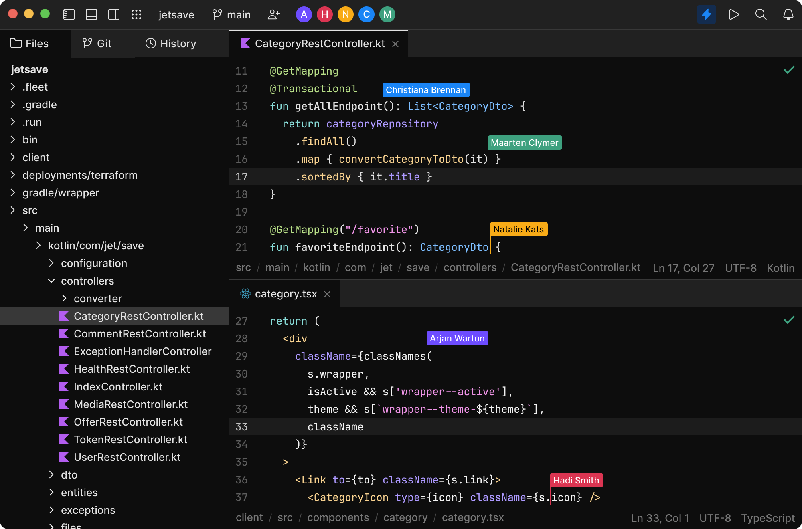

# OMB-06 - VS Code, l'éditeur de code le plus populaire

## Introduction

Dans cette leçon, nous allons découvrir l'éditeur de code le plus populaire au monde : Visual Studio Code.

## Objectifs

* Comprendre pourquoi les développeurs utilisent VS Code
* Installer VS Code
* Personnaliser son environnement de travail
* VS Code en pratique
  * Utiliser les extensions
  * Utiliser les commandes de VS Code
  * Utiliser les raccourcis clavier de VS Code
  * Utiliser le terminal intégré de VS Code
  * Utiliser le débogueur intégré de VS Code
  * Utiliser Git dans VS Code

## Liens vers les ressources

* [Visual Studio Code](https://code.visualstudio.com/)
* [Visual Studio Code - Documentation](https://code.visualstudio.com/docs)
* [Visual Studio Code - Extensions](https://marketplace.visualstudio.com/vscode)
* [Visual Studio Code - Tips and Tricks](https://code.visualstudio.com/docs/getstarted/tips-and-tricks)
* [Visual Studio Code - GitHub repository](https://github.com/microsoft/vscode)

Il existe egalement une chaîne YouTube dédiée à VS Code : [Visual Studio Code](https://www.youtube.com/c/Code).

## Visual Studio Code, c'est quoi ?

> Visual Studio Code est un **éditeur de code** extensible développé par **Microsoft** pour **Windows**, **Linux** et **macOS**.
> 
> Les fonctionnalités incluent la prise en charge du **débogage**, la **mise en évidence de la syntaxe**, la complétion intelligente du code, les **snippets**, la **refactorisation** du code et **Git** intégré. Les utilisateurs peuvent modifier le **thème**, les **raccourcis clavier**, les préférences et installer des **extensions** qui ajoutent des fonctionnalités supplémentaires.
>
> Le **code source** de Visual Studio Code provient du projet logiciel **libre** et **open source** VS Code de Microsoft publié sous la **licence MIT** permissive, mais les binaires compilés constituent un **freeware**, c'est-à-dire un logiciel gratuit pour toute utilisation mais **privateur**.
>
>Dans le sondage auprès des développeurs réalisé par Stack Overflow en 2021, Visual Studio Code a été classé comme l'outil d'environnement de développement le plus populaire, avec 71,06 % des 82 277 répondants déclarant l'utiliser.
>
> — Wikipédia FR - Visual Studio Code

### Lexique (Wikipédia)

* [editeur de code](https://fr.wikipedia.org/wiki/%C3%89diteur_de_texte)
* [Microsoft](https://fr.wikipedia.org/wiki/Microsoft)
* [Windows](https://fr.wikipedia.org/wiki/Microsoft_Windows)
* [Linux](https://fr.wikipedia.org/wiki/Linux)
* [macOS](https://fr.wikipedia.org/wiki/MacOS)
* [débogage](https://fr.wikipedia.org/wiki/D%C3%A9bogueur)
* [mise en évidence de la syntaxe](https://fr.wikipedia.org/wiki/Coloration_syntaxique)
* [complétion intelligente du code](https://fr.wikipedia.org/wiki/Compl%C3%A9tion_intelligente_du_code)
* [snippets](https://fr.wikipedia.org/wiki/Snippet)
* [refactorisation du code](https://fr.wikipedia.org/wiki/R%C3%A9usinage_de_code)

### VS Codium ou VS Code ?

VS Code est un logiciel propriétaire, mais il existe une version open source de VS Code : [VSCodium](https://vscodium.com/).

VSCodium est une version open source de VS Code, sans les fonctionnalités propriétaires de Microsoft. Parmi ces fonctionnalités, on retrouve notamment le suivi des utilisateurs, les mises à jour automatiques, les extensions Microsoft, etc.

Le choix de l'éditeur de code est une question de goût et de préférence. Vous pouvez utiliser VS Code ou VSCodium, ou même un autre éditeur de code comme [Atom](https://atom.io/), [Sublime Text](https://www.sublimetext.com/), [Notepad++](https://notepad-plus-plus.org/), [Brackets](http://brackets.io/), [Vim](https://www.vim.org/), [Emacs](https://www.gnu.org/software/emacs/), etc.

### JetBrains Fleet

Une alternative à VS Code est [JetBrains Fleet](https://www.jetbrains.com/fr-fr/fleet/), un éditeur de code proposé par JetBrains, l'éditeur de l'IDE [IntelliJ IDEA](https://www.jetbrains.com/fr-fr/idea/). Il s'agit d'un éditeur de code payant, mais il est possible de l'utiliser gratuitement pendant la phase de préversion publique.

### D'autres éditeurs de code

De très nombreux éditeurs de code existent, et il est difficile de faire une liste exhaustive. Voici quelques exemples :

<table>
  <tr>
    <td>
      

        <a href="https://code.visualstudio.com/">
          
           
          <b>Visual Studio Code</b>
        </a>
         
        <a href="https://code.visualstudio.com/" title="Visual Studio Code">🌍</a>
      

    </td>
    <td>
       
      
VSCodium

    </td>
    <td>
      
    </td>
    <td>
      
    </td>
  </tr>
  <tr>
    <td>
      
    </td>
    <td>
      
    </td>
    <td>
      
    </td>
    <td>
      
    </td>
</table>

## Pourquoi utiliser VS Code ?

**VS Code est gratuit et open source.** 

* Gratuit
* Open Source
* Multi-plateforme
* Personnalisable
* Très complet
* Très rapide

## Pour apprendre les racourcis clavier

Un **raccourci clavier** est une combinaison de touches qui permet d'effectuer une action. Par exemple, pour copier du texte, on utilise le raccourci clavier `Ctrl + C`. Pour coller du texte, on utilise le raccourci clavier `Ctrl + V`.

> Astuce : Pour avoir plus de détails sur un raccourci clavier, une ressource très pratique est [Keycode.info](https://keycode.info/). Il suffit de cliquer sur une touche du clavier pour avoir plus de détails sur le raccourci clavier associé.

Utiliser des raccourcis clavier permet de **gagner du temps et d'être plus efficace**. C'est pourquoi il est important de les apprendre. Pour cela, rien de mieux que les ressources suivantes :

### Quelques raccourcis clavier utiles pour VS Code

* `Ctrl + Shift + P` : ouvre la **palette de commandes**
* `Ctrl + P` : ouvre le **navigateur de fichiers**
* `Ctrl + Shift + N` : ouvre un **nouvel onglet**
* `Ctrl + W` : ferme l'**onglet actif**
* `Ctrl + Shift + W` : ferme tous les **onglets**
* `Ctrl + Tab` : passe à l'**onglet suivant**
* `Ctrl + Shift + Tab` : passe à l'**onglet précédent**
* `Ctrl + \` : ouvre le **terminal intégré**

### Liste complète des raccourcis clavier

* [Visual Studio Code - Keyboard Shortcuts for Windows](https://code.visualstudio.com/shortcuts/keyboard-shortcuts-windows.pdf)
* [Visual Studio Code - Keyboard Shortcuts for Mac](https://code.visualstudio.com/shortcuts/keyboard-shortcuts-macos.pdf)
* [Visual Studio Code - Keyboard Shortcuts for Linux](https://code.visualstudio.com/shortcuts/keyboard-shortcuts-linux.pdf)

## Questions

* Quelle est la différence entre un éditeur de texte et un éditeur de code ?
* Quels sont les avantages d'un éditeur de code ?
* Quels sont les avantages d'un éditeur de code open source ?
* Quels sont les avantages d'un éditeur de code gratuit ?
* Quels sont les avantages d'un éditeur de code multi-plateforme ?
* Quels sont les avantages d'un éditeur de code multi-langage ?
* `Ctrl + P` permet d'ouvrir le navigateur de fichiers. Quel est l'avantage de ce navigateur de fichiers par rapport à l'explorateur de fichiers de Windows ?