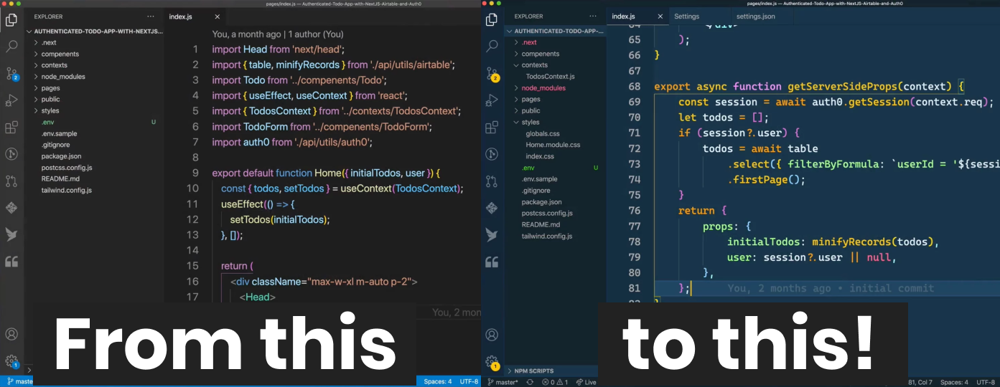

# OMB-06 - VS Code, l'éditeur de code le plus populaire

## Introduction

Dans cette leçon, nous allons découvrir l'éditeur de code le plus populaire au monde : Visual Studio Code.

## Objectifs

* Comprendre pourquoi les développeurs utilisent VS Code
* Installer VS Code
* Personnaliser son environnement de travail
* VS Code en pratique
  * Utiliser les extensions
  * Utiliser les commandes de VS Code
  * Utiliser les raccourcis clavier de VS Code
  * Utiliser le terminal intégré de VS Code
  * Utiliser le débogueur intégré de VS Code
  * Utiliser Git dans VS Code

## Liens vers les ressources

* [Visual Studio Code](https://code.visualstudio.com/)
* [Visual Studio Code - Documentation](https://code.visualstudio.com/docs)
* [Visual Studio Code - Extensions](https://marketplace.visualstudio.com/vscode)
* [Visual Studio Code - Tips and Tricks](https://code.visualstudio.com/docs/getstarted/tips-and-tricks)
* [Visual Studio Code - GitHub repository](https://github.com/microsoft/vscode)

Il existe egalement une chaîne YouTube dédiée à VS Code : [Visual Studio Code](https://www.youtube.com/c/Code).

## Visual Studio Code, c'est quoi ?

> Visual Studio Code est un **éditeur de code** extensible développé par **Microsoft** pour **Windows**, **Linux** et **
> macOS**.
>
> Les fonctionnalités incluent la prise en charge du **débogage**, la **mise en évidence de la syntaxe**, la complétion
> intelligente du code, les **snippets**, la **refactorisation** du code et **Git** intégré. Les utilisateurs peuvent
> modifier le **thème**, les **raccourcis clavier**, les préférences et installer des **extensions** qui ajoutent des
> fonctionnalités supplémentaires.
>
> Le **code source** de Visual Studio Code provient du projet logiciel **libre** et **open source** VS Code de Microsoft
> publié sous la **licence MIT** permissive, mais les binaires compilés constituent un **freeware**, c'est-à-dire un
> logiciel gratuit pour toute utilisation mais **privateur**.
>
>Dans le sondage auprès des développeurs réalisé par Stack Overflow en 2021, Visual Studio Code a été classé comme
> l'outil d'environnement de développement le plus populaire, avec 71,06 % des 82 277 répondants déclarant l'utiliser.
>
> — Wikipédia FR - Visual Studio Code

### Lexique (Wikipédia)

* [editeur de code](https://fr.wikipedia.org/wiki/%C3%89diteur_de_texte)
* [Microsoft](https://fr.wikipedia.org/wiki/Microsoft)
* [Windows](https://fr.wikipedia.org/wiki/Microsoft_Windows)
* [Linux](https://fr.wikipedia.org/wiki/Linux)
* [macOS](https://fr.wikipedia.org/wiki/MacOS)
* [débogage](https://fr.wikipedia.org/wiki/D%C3%A9bogueur)
* [mise en évidence de la syntaxe](https://fr.wikipedia.org/wiki/Coloration_syntaxique)
* [complétion intelligente du code](https://fr.wikipedia.org/wiki/Compl%C3%A9tion_intelligente_du_code)
* [snippets](https://fr.wikipedia.org/wiki/Snippet)
* [refactorisation du code](https://fr.wikipedia.org/wiki/R%C3%A9usinage_de_code)

### VS Codium ou VS Code ?

VS Code est un logiciel propriétaire, mais il existe une version open source de VS
Code : [VSCodium](https://vscodium.com/).

VSCodium est une version open source de VS Code, sans les fonctionnalités propriétaires de Microsoft. Parmi ces
fonctionnalités, on retrouve notamment le suivi des utilisateurs, les mises à jour automatiques, les extensions
Microsoft, etc.

Le choix de l'éditeur de code est une question de goût et de préférence. Vous pouvez utiliser VS Code ou VSCodium, ou
même un autre éditeur de code comme [Atom](https://atom.io/), [Sublime Text](https://www.sublimetext.com/)
, [Notepad++](https://notepad-plus-plus.org/), [Brackets](http://brackets.io/), [Vim](https://www.vim.org/)
, [Emacs](https://www.gnu.org/software/emacs/), etc.

### JetBrains Fleet

Une alternative à VS Code est [JetBrains Fleet](https://www.jetbrains.com/fr-fr/fleet/), un éditeur de code proposé par
JetBrains, l'éditeur de l'IDE [IntelliJ IDEA](https://www.jetbrains.com/fr-fr/idea/). Il s'agit d'un éditeur de code
payant, mais il est possible de l'utiliser gratuitement pendant la phase de préversion publique.

### D'autres éditeurs de code

De très nombreux éditeurs de code existent, et il est difficile de faire une liste exhaustive. Voici quelques exemples :

<table>
  <tr>
    <td>
      

        <a href="https://code.visualstudio.com/" target="_blank" rel="noopener noreferrer">
          
           
          <b>Visual Studio Code</b>
        </a>
         
        <a href="https://code.visualstudio.com/" title="Visual Studio Code">🌍</a>
      

    </td>
    <td>
      

        <a href="https://vscodium.com/" target="_blank" rel="noopener noreferrer">
          
           
          <b>VSCodium</b>
        </a>
         
        <a href="https://vscodium.com/" title="VSCodium">🌍</a>
      

    </td>
    <td>
      

        <a href="https://atom.io/" target="_blank" rel="noopener noreferrer">
          
           
          <b>Atom</b>
        </a>
         
        <a href="https://atom.io/" title="Atom">🌍</a>
        

    </td>
    <td>
      

        <a href="https://www.sublimetext.com/" target="_blank" rel="noopener noreferrer">
          
           
          <b>Sublime Text</b>
        </a>
         
        <a href="https://www.sublimetext.com/" title="Sublime Text">🌍</a>
      

    </td>
  </tr>
  <tr>
    <td>
      

        <a href="https://notepad-plus-plus.org/" target="_blank" rel="noopener noreferrer">
          
           
          <b>Notepad++</b>
        </a>
         
        <a href="https://notepad-plus-plus.org/" title="Notepad++">🌍</a>
      

    </td>
    <td>
      

        <a href="http://brackets.io/" target="_blank" rel="noopener noreferrer">
          
           
          <b>Brackets</b>
        </a>
         
        <a href="http://brackets.io/" title="Brackets">🌍</a>
      

    </td>
    <td>
      

        <a href="https://www.vim.org/" target="_blank" rel="noopener noreferrer">
          
           
          <b>Vim</b>
        </a>
         
        <a href="https://www.vim.org/" title="Vim">🌍</a>
      

    </td>
    <td>
      

        <a href="https://www.gnu.org/software/emacs/" target="_blank" rel="noopener noreferrer">
          
           
          <b>Emacs</b>
        </a>
         
        <a href="https://www.gnu.org/software/emacs/" title="Emacs">🌍</a>
      

    </td>
</table>

## Pourquoi utiliser VS Code ?

**VS Code est gratuit et open source.**

* Gratuit
* Open Source
* Multi-plateforme
* Personnalisable
* Très complet
* Très rapide

## Les racourcis clavier

Un **raccourci clavier** est une combinaison de touches qui permet d'effectuer une action. Par exemple, pour copier du
texte, on utilise le raccourci clavier `Ctrl + C`. Pour coller du texte, on utilise le raccourci clavier `Ctrl + V`.

> Astuce : Pour avoir plus de détails sur un raccourci clavier, une ressource très pratique
> est [Keycode.info](https://keycode.info/). Il suffit de cliquer sur une touche du clavier pour avoir plus de détails sur
> le raccourci clavier associé.

Utiliser des raccourcis clavier permet de **gagner du temps et d'être plus efficace**. C'est pourquoi il est important
de les apprendre. Pour cela, rien de mieux que les ressources suivantes :

### Quelques raccourcis clavier utiles pour VS Code

* `Ctrl + Shift + P` : ouvre la **palette de commandes**
* `Ctrl + P` : ouvre le **navigateur de fichiers**
* `Ctrl + Shift + N` : ouvre un **nouvel onglet**
* `Ctrl + W` : ferme l'**onglet actif**
* `Ctrl + Shift + W` : ferme tous les **onglets**
* `Ctrl + Tab` : passe à l'**onglet suivant**
* `Ctrl + Shift + Tab` : passe à l'**onglet précédent**
* `Ctrl + \` : ouvre le **terminal intégré**

### Liste complète des raccourcis clavier

* [Visual Studio Code - Keyboard Shortcuts for Windows](https://code.visualstudio.com/shortcuts/keyboard-shortcuts-windows.pdf)
* [Visual Studio Code - Keyboard Shortcuts for Mac](https://code.visualstudio.com/shortcuts/keyboard-shortcuts-macos.pdf)
* [Visual Studio Code - Keyboard Shortcuts for Linux](https://code.visualstudio.com/shortcuts/keyboard-shortcuts-linux.pdf)

> Pratique : Si vous connaissez déjà les raccourcis clavier de votre éditeur de texte favori
> et que vous souhaitez les utiliser dans VS Code, vous pouvez les configurer de la manière suivante :
> * Ouvrez la palette de commandes avec `Ctrl + Shift + P`
> * Tapez `Keymap` (le panel des extensions s'ouvre automatiquement)
> * Installez l'extension `Keymap` relative à votre éditeur de texte favori

## La palette de commandes

La **palette de commandes** est un moyen rapide d'accéder à toutes les commandes disponibles dans VS Code. Pour
l'ouvrir, il suffit d'appuyer sur `Ctrl + Maj + P` ou de cliquer sur le menu `Affichage` puis sur `Palette de commandes`.

> S'il n'y a qu'un raccourci a connaitre, c'est celui-ci. Il permet d'accéder à toutes les commandes disponibles dans VS Code.

## Les extensions

Une **extension** est un module complémentaire qui permet d'ajouter des fonctionnalités à VS Code. Par exemple, il existe
une extension pour ajouter le support de la syntaxe Markdown. Il existe également une extension pour ajouter le support
de la syntaxe PHP.

> Astuce : Pour avoir plus de détails sur une extension, une ressource très pratique
> est [VS Code Marketplace](https://marketplace.visualstudio.com/VSCode). Il suffit de cliquer sur une extension pour avoir plus de détails sur
> l'extension.

Les plus geek d'entre vous peuvent développer leurs propres extensions. Pour cela, il suffit de suivre le tutoriel
suivant : [Create your first extension](https://code.visualstudio.com/api/get-started/your-first-extension).

### Quelques extensions utiles pour VS Code

L'article de blog suivant présente une liste d'extensions utiles pour VS Code :
[Top Visual Studio Code extensions for developers in 2022](https://blog.openreplay.com/top-visual-studio-code-extensions-for-developers-in-2022). Parmi les extensions présentées, on peut citer :
* Auto Close Tag - Ajoute automatiquement la balise de fermeture d'un tag HTML
* Auto Rename Tag - Renomme automatiquement la balise de fermeture d'un tag HTML
* Better Comments - Permet d'ajouter des commentaires plus lisibles
* GitLens - Permet d'ajouter des fonctionnalités supplémentaires à Git
* GitHub Copilot - Permet d'obtenir de l'aide pour écrire du code via une IA (fonctionnalité en beta)

Mon extension préférée est [Live Server](https://marketplace.visualstudio.com/items?itemName=ritwickdey.LiveServer). Elle permet de lancer un serveur web local pour tester son code HTML/CSS/JS. Pour cela, il suffit de cliquer sur le bouton `Go Live` dans la barre d'état en bas de l'éditeur. Le serveur web est lancé sur le port 5500. Pour arrêter le serveur web, il suffit de cliquer sur le bouton `Stop Server` dans la barre d'état en bas de l'éditeur.

C'est une extension très pratique pour tester son code HTML/CSS/JS. Elle permet de tester son code sans avoir à l'héberger sur un serveur web distant tout en garantissant une expérience utilisateur proche de celle d'un site web hébergé sur un serveur web distant.

> Pratique : Si vous souhaitez ajouter une extension à VS Code, vous pouvez le faire de la manière suivante :
> * Ouvrez la palette de commandes avec `Ctrl + Shift + P`
> * Tapez `Extensions` (le panel des extensions s'ouvre automatiquement)
> * Recherchez l'extension que vous souhaitez ajouter
> * Cliquez sur le bouton `Install` pour installer l'extension
> * Redémarrez VS Code

> Exercice 2 : Personnalisez VS Code en ajoutant une extension.
> Vous pouvez ajouter l'extension [Material Icon Theme](https://marketplace.visualstudio.com/items?itemName=PKief.material-icon-theme) pour ajouter des icônes aux fichiers et dossiers. Vous pouvez ensuite définir l'extension comme thème d'icônes dans les paramètres de VS Code.

## Personnaliser VS Code

Il est possible de personnaliser VS Code en modifiant les paramètres de l'éditeur. Pour cela, il suffit de suivre le tutoriel
suivant : [User and Workspace Settings](https://code.visualstudio.com/docs/getstarted/settings).

### Quelques paramètres utiles pour VS Code

* `editor.fontFamily` : permet de définir la police de caractères utilisée dans l'éditeur
* `editor.fontSize` : permet de définir la taille de la police de caractères utilisée dans l'éditeur
* `editor.fontLigatures` : permet d'activer/désactiver les ligatures de la police de caractères utilisée dans l'éditeur
* `editor.wordWrap` : permet d'activer/désactiver le retour à la ligne automatique
* `editor.tabSize` : permet de définir la taille d'un tabulation
* `editor.insertSpaces` : permet d'activer/désactiver l'insertion d'espaces au lieu de tabulations
* `editor.renderWhitespace` : permet d'activer/désactiver l'affichage des espaces et tabulations
* ...

> Exercice 1 : Personnalisez VS Code en modifiant les paramètres de l'éditeur.
> Une superbe liste de polices de caractères est disponible sur le site [Nerd Fonts](https://www.nerdfonts.com/font-downloads). Vous pouvez choisir une police de caractères dans la liste et la télécharger. Vous pouvez ensuite définir la police de caractères dans les paramètres de VS Code.

## Exercices

### Exercice 1 : Emmet et Live Server

Pour cet exercice, vous allez utiliser Emmet et Live Server pour créer une page web simple. 

**Vous aurez besoin de :**
* l'extension [Live Server](https://marketplace.visualstudio.com/items?itemName=ritwickdey.LiveServer)
* avoir des notions de HTML/CSS
* lire la documentation d'Emmet : [Emmet Documentation](https://docs.emmet.io/)
* **Une Cheetsheet d'Emmet est disponible à cette adresse : [Emmet Cheetsheet](https://docs.emmet.io/cheat-sheet/)**
* **Un tutoriel en français est disponible à cette adresse : [Tutoriel Emmet](https://nouvelle-techno.fr/articles/utiliser-emmet-pour-accelerer-le-developpement)**

Voici les étapes à suivre pour réaliser cet exercice :
* Créez sur votre bureau un dossier `exercice-1`
* Ouvrez ce dossier avec VS Code
* Créez un fichier `index.html`
* Ouvrez le fichier `index.html` dans l'éditeur
* Créez une page web simple avec Emmet
* Ajoutez un titre à la page web
* Ajoutez un paragraphe à la page web
* Ajoutez une image à la page web
* Ajoutez un lien vers une page web externe à la page web
* Ajoutez un lien vers une page web interne à la page web
* Ajoutez une liste à la page web

### Exercice 2 : Pimp my VS Code

Dans cet exercice, vous allez personnaliser VS Code. Laissez parler votre créativité !

**Vous aurez besoin de :**
* plusieurs extensions pour VS Code
* une police de caractères pour VS Code
* trouver des thèmes pour VS Code
* **Une liste de thèmes pour VS Code est disponible à cette adresse : [VS Code Themes](https://marketplace.visualstudio.com/search?term=tag%3Athemes&target=VSCode&category=Themes&sortBy=Relevance)**

### Exercice 3 : Questionnaire

Ces questions sont à titre indicatif. Vous n'êtes pas obligé de les traiter. Elles sont là pour vous aider à aller plus loin et renforcer vos connaissances.

* Quelle est la différence entre un éditeur de texte et un éditeur de code ?
* Quels sont les avantages d'un éditeur de code ?
* Quels sont les avantages d'un éditeur de code open source ?
* Quels sont les avantages d'un éditeur de code gratuit ?
* Quels sont les avantages d'un éditeur de code multi-plateforme ?
* Quels sont les avantages d'un éditeur de code multi-langage ?
* `Ctrl + P` permet d'ouvrir le navigateur de fichiers. Quel est l'avantage de ce navigateur de fichiers par rapport à
  l'explorateur de fichiers de Windows ?

## Pour aller plus loin

Une vidéo de présentation de 25 astuces de productivité pour VS Code est disponible à cette adresse : [25 VS Code Productivity Tips and Speed Hacks](https://www.youtube.com/watch?v=ifTF3ags0XI
)

## Conclusion

Dans ce tutoriel, vous avez appris à installer VS Code et à l'utiliser. Vous avez également appris à personnaliser VS Code. Vous avez également appris à utiliser Emmet pour créer des pages web plus rapidement.

Vous avez maintenant les bases pour utiliser VS Code. Vous pouvez maintenant vous lancer dans la création de vos projets web.